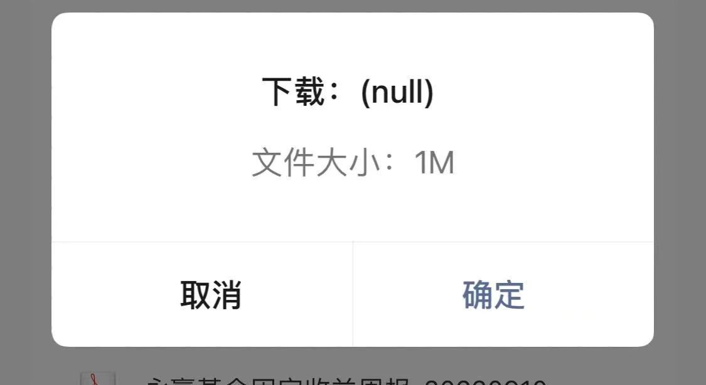

在 iOS 系统中，如果打开文件下载链接，会像下图这样，不显示文件名称，只显示一个 null。



解决办法就是用下面这段代码实现下载功能：

```js
function download (url, fileName) {
  const x = new XMLHttpRequest()
  x.responseType = 'blob'
  x.open('GET', url, true)
  x.send()
  x.onload = () => {
    const downloadElement = document.createElement('a')
    const href = window.URL.createObjectURL(x.response) // create download url
    downloadElement.href = href
    downloadElement.download = fileName // set filename (include suffix)
    document.body.appendChild(downloadElement) // append <a>
    downloadElement.click() // click download
    document.body.removeChild(downloadElement) // remove <a>
    window.URL.revokeObjectURL(href) // revoke blob
  }
}
```

参考链接：[微信内置浏览器下载pdf的时候标题为null?](https://developers.weixin.qq.com/community/develop/doc/00008ee33cc6a0ea948e3c2d551c00)。