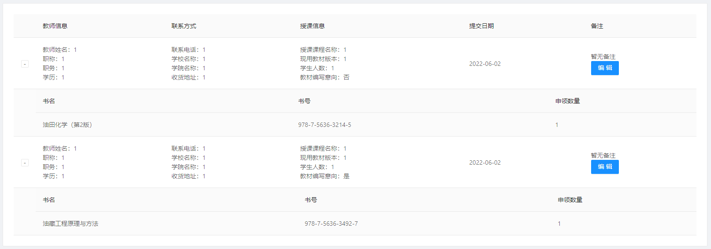

## Ant Design Vue

### 让组件内显示的文字可换行

Google：`ant design vue text newline`。

参考资料：[Antd table how to put text into cell in several lines](https://stackoverflow.com/questions/44563104/antd-table-how-to-put-text-into-cell-in-several-lines)。

解决方法：设置相关组件或元素的 `white-space` 属性值为 `pre` 即可。

### 嵌套子表格显示父表格数据

Google：`ant design vue nested child table`。

参考文章：[Ant design vue different data in nested tables](https://stackoverflow.com/questions/60094380/ant-design-vue-different-data-in-nested-tables)。

关键代码：

```html
<!-- 父表格 -->
<a-table
  :dataSource="forms"
>
  <!-- 子表格 -->
  <template v-slot:expandedRowRender="record">
    <a-table
      :data-source="record.books"
    >
    </a-table>
  </template>
</a-table>
```

```js
// 对应数据
data() {
  return {
    forms: [
      {
        ...
         books: [...],
      },
      {
        ...
         books: [...],
      },
    ],
  },
},
```

### 嵌套子表格默认全部展开

Google：`ant design vue expandedRowKeys`。

参考文章：[Ant Design Vue子表格展开只展开一行，其他行折叠](https://blog.51cto.com/u_15453248/5015576)。

关键代码：

```html
<!-- 父表格 -->
<a-table
  :expandedRowKeys="expandedRowKeys"
>
</a-table>
```

```js
// 设置需默认展开的子表格的关联字段
this.expandedRowKeys = result.data.map((ele) => ele._id)
```

呈现效果：


