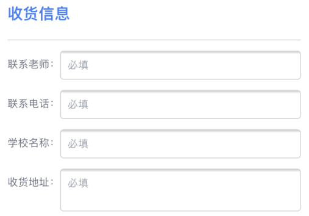
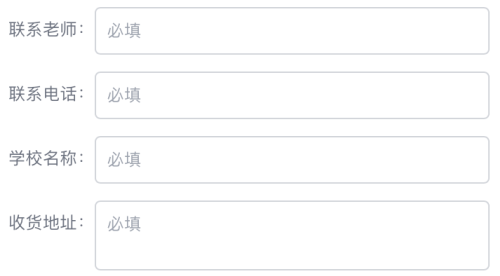

## 文字渐变效果

搜索关键词：`css text background linear gradient`。

参考文章：[Gradient Text | CSS-Tricks](https://css-tricks.com/snippets/css/gradient-text/)。

关键代码

```css
background: -webkit-linear-gradient(#eee, #333);
-webkit-background-clip: text;
-webkit-text-fill-color: transparent;
```

## CSS 实现输入光标闪烁动画

Google `css cursor blink`。

参照搜索结果的第一篇 [Simple blinking cursor animation using CSS](https://www.amitmerchant.com/simple-blinking-cursor-animation-using-css/) 即可实现，思路其实也挺简单，关键的是 `animation` 属性的 `step(2)` 这个值，让光标的闪烁效果更接近于真实形态。

## 让浏览器显示小于 12px 的字体

在做页面的时候，发现浏览器对于 font-size 小于 12px 的字体，实际显示出来的是 12px。

Google `html font size than 12px`，发现在 [Font-size <12px doesn't have effect in Google Chrome](https://stackoverflow.com/questions/2295095/font-size-12px-doesnt-have-effect-in-google-chrome) 这个回答里，有人说能解决，有人说不能解决。

又换成中文搜索 `浏览器 字号 12px`，网上的解决方案其实和英语搜索结果一样，最后用 `transform: scale()` 属性解决了。

## 移除旧版 iOS Safari input/textarea 控件上方的阴影效果

在开发 Web 页面时，发现在 iOS 13 的 Safari 上，input/textarea 控件上方有阴影，如下图所示。



用 `ios safari input shadow` 作为关键词进行查询，发现原来是旧版 iOS Safari 为 input/textarea 控件设置了 `appearance` 属性，把这个属性去掉就好了。

解决方案：[Remove iOS input shadow](https://stackoverflow.com/questions/23211656/remove-ios-input-shadow)。

关键代码：

```css
-webkit-appearance: none;
-moz-appearance: none;
appearance: none;
```

应用上面 CSS 后的效果如下图所示：


