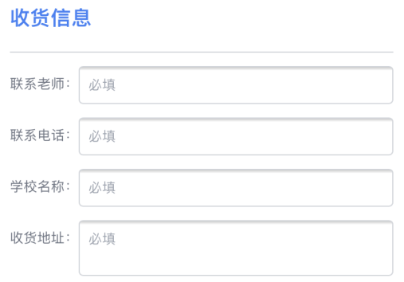
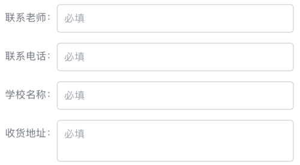

## CSS 隐藏滚动条

参考文章：[How TO - Hide Scrollbar](https://www.w3schools.com/howto/howto_css_hide_scrollbars.asp)

```css
/* Hide scrollbar for Chrome, Safari and Opera */
.example::-webkit-scrollbar {
  display: none;
}

/* Hide scrollbar for IE, Edge and Firefox */
.example {
  -ms-overflow-style: none;  /* IE and Edge */
  scrollbar-width: none;  /* Firefox */
}
```

## 渐变边框 v2

搜索关键词：`css gradient border before class`。

参考文章：[How to create rounded gradient borders with any background in CSS](https://benfrain.com/how-to-create-rounded-gradient-borders-with-any-background-in-css/)。

关键代码：

```html
<div className="gradient-border-card relative before:rounded-xl before:border-2">
  <p>Some text here</p>
</div>
``` 

```css
.gradient-border-card::before {
  content: "";
  position: absolute;
  inset: 0;
  border-color: transparent;
  /* 下面这行设置渐变边框的颜色 */
  background: linear-gradient(180deg, #FFFFFF 0%, #999999 100%) border-box;
  -webkit-mask: linear-gradient(#fff 0 0) padding-box, linear-gradient(#fff 0 0);
  mask: linear-gradient(#fff 0 0) padding-box, linear-gradient(#fff 0 0);
  -webkit-mask-composite: destination-out;
  mask-composite: exclude;
}
```

## 渐变边框

示例代码（React）：

```jsx
// 容器元素
<div className="relative flex items-center justify-center h-10 overflow-hidden font-semibold rounded-full">
  // 渐变背景，被后面设置了透明边框的元素遮挡，实现渐变边框效果
  <div className="absolute top-0 bottom-0 left-0 right-0 bg-gradient-to-r from-gradFrom to-gradTo"></div>
  // 设置背景色和透明边框,bg-clip-padding 属性确保透明边框的效果
  <div className="box-border z-10 flex items-center justify-center h-full px-8 border-2 border-transparent rounded-full bg-clip-padding bg-light">
    {btnText}
  </div>
</div>
```

## 响应式设计的常见断点尺寸

关键词：`common breakpoints for responsive design`。

结果：

- Mobile devices – 320px — 480px.
- iPads, Tablets – 481px — 768px.
- Small screens, laptops – 769px — 1024px.
- Desktops, large screens – 1025px — 1200px.
- Extra large screens, TV – 1201px, and more.

合理方案：

如果要为移动端和 PC 端分别设置不同的样式，就以 768px 为区分，屏幕宽度小于等于该尺寸的都用移动端设计稿，大于的都用 PC 端设计稿。

## Variable Font/可变字体显示不同字号

搜索关键词：`Variable font weight`。

参考链接：

- [Support font weight for variable fonts #3225](https://github.com/tailwindlabs/tailwindcss/discussions/3225)。
- [Introduction to variable fonts on the web](https://web.dev/variable-fonts/#font-variation-settings-inheritance)。
- [CSS font-weight numbers: how do they work?](https://stackoverflow.com/questions/35471486/css-font-weight-numbers-how-do-they-work)。

代码如下，关键有几点：

1. 引入可变字体，如 woff2 格式的；
2. 设置字号范围，即下面的 `font-weight: 100 900`。

```css
@font-face {
  font-family: 'ClashDisplay-Variable';
  src: url('@/assets/fonts/ClashDisplay-Variable.woff2') format('woff2');
  font-weight: 100 900;
  font-display: swap;
  font-style: normal;
}
```

## 文字渐变效果

搜索关键词：`css text background linear gradient`。

参考文章：[Gradient Text | CSS-Tricks](https://css-tricks.com/snippets/css/gradient-text/)。

关键代码

```css
background: -webkit-linear-gradient(#eee, #333);
-webkit-background-clip: text;
-webkit-text-fill-color: transparent;
```

## CSS 实现输入光标闪烁动画

Google `css cursor blink`。

参照搜索结果的第一篇 [Simple blinking cursor animation using CSS](https://www.amitmerchant.com/simple-blinking-cursor-animation-using-css/) 即可实现，思路其实也挺简单，关键的是 `animation` 属性的 `step(2)` 这个值，让光标的闪烁效果更接近于真实形态。

## 让浏览器显示小于 12px 的字体

在做页面的时候，发现浏览器对于 font-size 小于 12px 的字体，实际显示出来的是 12px。

Google `html font size than 12px`，发现在 [Font-size <12px doesn't have effect in Google Chrome](https://stackoverflow.com/questions/2295095/font-size-12px-doesnt-have-effect-in-google-chrome) 这个回答里，有人说能解决，有人说不能解决。

又换成中文搜索 `浏览器 字号 12px`，网上的解决方案其实和英语搜索结果一样，最后用 `transform: scale()` 属性解决了。

## 移除旧版 iOS Safari input/textarea 控件上方的阴影效果

在开发 Web 页面时，发现在 iOS 13 的 Safari 上，input/textarea 控件上方有阴影，如下图所示。



用 `ios safari input shadow` 作为关键词进行查询，发现原来是旧版 iOS Safari 为 input/textarea 控件设置了 `appearance` 属性，把这个属性去掉就好了。

解决方案：[Remove iOS input shadow](https://stackoverflow.com/questions/23211656/remove-ios-input-shadow)。

关键代码：

```css
-webkit-appearance: none;
-moz-appearance: none;
appearance: none;
```

应用上面 CSS 后的效果如下图所示：



## iOS Safari 100vh 页面高度被遮挡

写了一个移动 Web 页面，CSS 设置页面的高度为 100vh，结果发现在 iPhone 7 的 Safari 浏览器上，页面纵向高度会被浏览器本身的界面元素占据一部分，在 iPhone 11 上则没有这个问题。

用 `iOS Safari 100vh covered by` 作为关键词搜索，发现的确存在这个问题。尝试了几种方法都不管用，最后干脆把高度设置为 `100%` 了，不折腾了。

## 使元素保持长宽比

Google `css set element height same as width`。

[Height equal to dynamic width (CSS fluid layout) [duplicate]](https://stackoverflow.com/questions/5445491/height-equal-to-dynamic-width-css-fluid-layout)

只需要给元素本身设置 CSS 样式即可:

```css
.some_element {
    position: relative;
    width: 20%;
    height: 0;
    padding-bottom: 20%;
}
```

## 父元素 overflow hidden + 子元素正常滚动

在开发一个页面的时候，需要让页面中的一个元素显示为固定高度，但其子元素又需要能够正常的上下滚动（高度超出父元素时）。

在 [Overflow hidden with nested overflow scroll not working](https://stackoverflow.com/q/43539284/2667665) 这个帖子中，提问者自己就已经找到了解决方案，整体思路如下：

1. 对于设置了 `overflow: hidden;` 属性的父元素，再为其添加 `display: flex;` 和 `flex-direction:column;` 属性。
2. 父元素和子元素之间增加一个容器元素，CSS 属性设置为 `overflow: auto;` 和 `flex-grow:1;`，这样可以让容器元素和子元素的宽高相同，并且可以正常地滚动。
