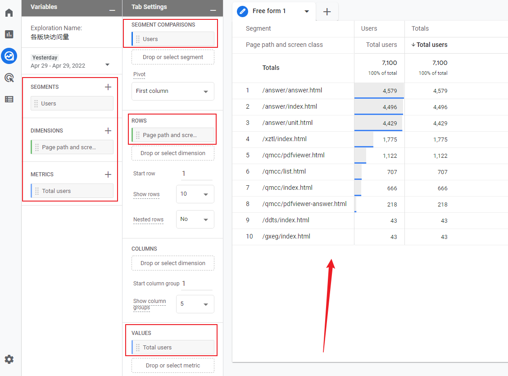
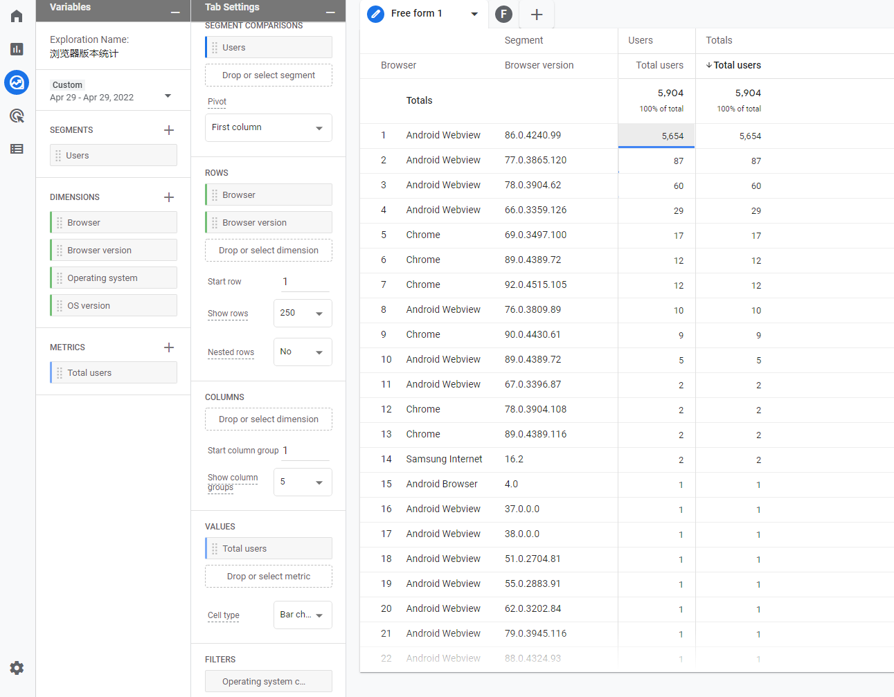

## 查看个性化数据

根据官方的回答，浏览器版本这样的自定义数据可以在 GA4 的 Explore 版块查看，Reports 版块和 Data API 目前不提供，未来 
 **有可能** 提供。

> 消息来源：[Browser version dimension missing in GA4 API](https://stackoverflow.com/questions/68256046/browser-version-dimension-missing-in-ga4-api)

### 统计各页面访问用户数 - 字段设置

SEGEMENTS: Users

> 可以先添加 User 相关的条目，然后再删除，依然会统计该字段。

DIMENSIONS: Page path and screen class

METRICS: Total users

最终结果如下图所示：

### 统计手机浏览器版本/系统版本用户数

可以通过 Filter 来对接过进行筛选，然后就可以分别查看 Android 和 iOS 设备的浏览器版本/系统版本。

> iOS 浏览器内核随系统版本而固定，所以查看系统版本即可。

## 数据保存时长

根据官方文档：[Data retention](https://support.google.com/analytics/answer/7667196)，不同的数据有不同的保存时长，后面需要仔细研究文档内容，确定各类数据的保存时长。

尽量将各项数据保存至本地。

## 导出数据

直接在 Google Analytics 界面导出数据的话，不是纯粹的数据，还会有一些附加的表头。

官方接口的话，整体流程见 [Analytics Data API Overview](https://developers.google.com/analytics/devguides/reporting/data/v1) ，关键的具体流程见 [API Quickstart](https://developers.google.com/analytics/devguides/reporting/data/v1/quickstart-client-libraries#node.js)。

## 结合 Google Sheets 做数据统计分析

搜索关键词 `google sheet import from google analytics`，发现的确提供了这项功能，但是在照着教程操作的时候，Google Sheets 却提示找不到 Report，后面还需要解决这块儿的问题，不然手动统计还是不够高效。

## 内容分组

[[GA4] Content grouping](https://support.google.com/analytics/answer/11523339)

> Categorize related pages and screens into custom buckets

Google `google content group` 这组关键词，显示的文章都是基于旧版 Google 统计的，把时间范围限制为最近一年，就能够找到基于最新的 GA4 写的文章了。

[How to Implement Content Group in Google Analytics 4](https://dataenthusiast.it/english-version/how-to-implement-content-group-in-google-analytics-4/) 这篇文章看起来讲得比较详细，也是搜索结果的第一条，找时间仔细研究一下，应用到出版社的各个网站上。

## 统计自定义事件

官方文档：

- [[GA4] 自定义事件](https://support.google.com/analytics/answer/12229021?hl=zh-Hans&ref_topic=9756175)
- [设置自定义事件](https://developers.google.com/analytics/devguides/collection/ga4/events?client_type=gtag)
- [设置事件参数](https://developers.google.com/analytics/devguides/collection/ga4/event-parameters?client_type=gtag)
- [[GA4] 自定义维度和指标](https://support.google.com/analytics/answer/10075209)
- [[GA4] Google Analytics（分析）维度和指标](https://support.google.com/analytics/answer/9143382)
