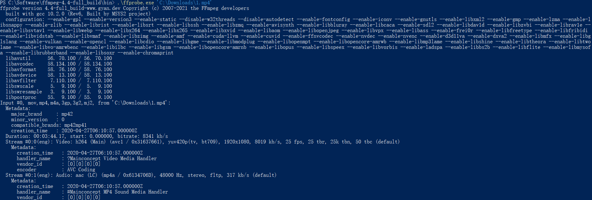

## FFmpeg

### 处理带黑边视频时报错

在用 FFmpeg 处理带黑边的视频时，报错信息如下所示：

```
[h264 @ 0000026d3d1bbe40] no frame!

[NULL @ 0000026d3cd92200] missing picture in access unit with size 100

[vist#0:0/h264 @ 0000026d3ce4ea00] Error submitting packet to decoder: Invalid data found when processing input
```

上网查了查，也没查到什么相关的信息，但是在处理同一批视频的时候，对于那些没有黑边的视频就不会报错，因此猜测与视频左右两侧的黑边有关。

于是用 Handbrake 这个软件先把视频的黑边裁掉了，然后再用 FFmpeg 处理，终于不报错了。

### 循环播放视频作为推流

```sh
for((;;)); do \
    ffmpeg -re -i ./source.flv \
    -c copy \
    -f flv rtmp://localhost/live/livestream; \
    sleep 1; \
done
```

### main profile 不支持 4:4:4

关键词：`ffmpeg main profile doesn't support 4:4:4`。

参考解决方案：[ffmpeg convert from H.264 (High 4:4:4 Profile) to H.264 (Main Profile)](https://stackoverflow.com/questions/37967120/ffmpeg-convert-from-h-264-high-444-profile-to-h-264-main-profile)。

关键代码：在 `-profile:v main` 后面加上 `-pix_fmt yuv420p` 即可。

### 用 FFmpeg 合并视频文件

Google: `ffmpeg merge videos`

参考文章：[How to concatenate two MP4 files using FFmpeg?(https://stackoverflow.com/a/11175851/2667665)。

#### 需要重编码的情况

```sh
ffmpeg -i opening.mkv -i episode.mkv -i ending.mkv \
-filter_complex "[0:v] [0:a] [1:v] [1:a] [2:v] [2:a] \
concat=n=3:v=1:a=1 [v] [a]" \
-map "[v]" -map "[a]" output.mkv
```

#### 无需重编码但格式不支持文件级合并（大部分都是这种情况）

```sh
$ cat mylist.txt
file '/path/to/file1'
file '/path/to/file2'
file '/path/to/file3'
    
$ ffmpeg -f concat -safe 0 -i mylist.txt -c copy output.mp4
```

#### 无需重编码且格式支持文件级合并（MPEG-1, MPEG-2 PS, DV可以，MP4不行）

```sh
ffmpeg -i "concat:input1|input2" -codec copy output.mkv
```

### 将 10-bit/12-bit HEVC 视频转换为 8-bit H.264

Google: `convert 10bit hevc to 8bit`。

参考方法：[How do I convert 10-bit H.265 / HEVC videos to H.264 without quality loss?](https://superuser.com/a/1381151/432588)。

一句话代码：`ffmpeg -i input.mp4 -map 0 -c:v libx264 -crf 18 -vf format=yuv420p -c:a copy output.mp4`。

## FFProbe 用法示例

### 默认输出

```sh
> .\ffprobe.exe 'media_file_full_path'
```


用默认参数输出的话，会输出一些平时用不到的信息，包括 版权、编译信息、相关库等。

### 只输出媒体文件信息

```sh
> .\ffprobe.exe 'media_file_full_path' -hide_banner
```



加上 `-hide_banner` 参数之后，就只输出媒体文件本身的信息。

[常用参数](./img/ffprobe-2.png)

### 获取视频分辨率

```sh
> .\ffprobe.exe -v error -select_streams v:0 -show_entries stream=width,height -of csv=s=x:p=0 'media_file_full_path'
# 输出结果样例
1920x1080
```

[How do I use ffmpeg to get the video resolution?](https://superuser.com/questions/841235/how-do-i-use-ffmpeg-to-get-the-video-resolution)

### 参考资料

#### 码率控制

[[FFmpeg] ffmpeg 常用命令](https://www.cnblogs.com/frost-yen/p/5848781.html)

码率控制对于在线视频比较重要。因为在线视频需要考虑其能提供的带宽。

那么，什么是码率？很简单：
bitrate = file size / duration
比如一个文件20.8M，时长1分钟，那么，码率就是：
biterate = 20.8M bit/60s = 20.8*1024*1024*8 bit/60s= 2831Kbps
一般音频的码率只有固定几种，比如是128Kbps，
那么，video的就是
video biterate = 2831Kbps -128Kbps = 2703Kbps。

那么ffmpeg如何控制码率。
ffmpg控制码率有3种选择，-minrate -b:v -maxrate
-b:v主要是控制平均码率。
比如一个视频源的码率太高了，有10Mbps，文件太大，想把文件弄小一点，但是又不破坏分辨率。
ffmpeg -i input.mp4 -b:v 2000k output.mp4
上面把码率从原码率转成2Mbps码率，这样其实也间接让文件变小了。目测接近一半。
不过，ffmpeg官方wiki比较建议，设置b:v时，同时加上 -bufsize
-bufsize 用于设置码率控制缓冲器的大小，设置的好处是，让整体的码率更趋近于希望的值，减少波动。（简单来说，比如1 2的平均值是1.5， 1.49 1.51 也是1.5, 当然是第二种比较好）
ffmpeg -i input.mp4 -b:v 2000k -bufsize 2000k output.mp4

-minrate -maxrate就简单了，在线视频有时候，希望码率波动，不要超过一个阈值，可以设置maxrate。
ffmpeg -i input.mp4 -b:v 2000k -bufsize 2000k -maxrate 2500k output.mp4

#### 调整分辨率

- [Change video resolution ffmpeg](https://stackoverflow.com/questions/34391499/change-video-resolution-ffmpeg)
- [Resize/Scale/Change Resolution of a Video using FFmpeg Easily](https://ottverse.com/change-resolution-resize-scale-video-using-ffmpeg/)

#### 未分类

- [FFprobe使用指南](https://www.cnblogs.com/tinywan/p/6369104.html)

## PowerRename

### PowerRename 批量重命名时顺序乱了

关键词：`powerrename sort order`。

参考文章：[[PowerRename] files are not sorted alphabetically #9873](https://github.com/microsoft/PowerToys/issues/9873)。

解决方法：选中了需要重命名的一批文件后，在第一个文件上点右键调用 PowerRename，弹出窗口中的文件顺序就正常了……

## Robocopy

> 目的：用于实现两台 Windows 服务器之间的数据同步。

### 用法示例

```
robocopy `
\\192.168.8.28\e\upcweb\ai ` // 源目录
D:\upcweb\ai ` // 目标目录
/S /DCOPY:DAT ` // 不复制空目录，并复制目录的数据、属性、时间戳
/XD .git ` // 不复制 .git 目录
/R:1 // 失败后不重试
```


